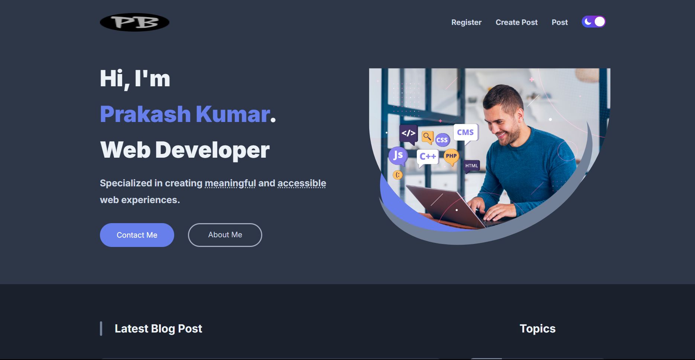

# 📝 Blog Website

A fully functional and visually appealing **Blog Platform** where users can write, read, and explore blog posts with images, categories, and tags. Built using **Node.js**, **Express.js**, **MongoDB**, and a **responsive frontend** using HTML, CSS, and JavaScript. This project demonstrates full-stack web development with REST APIs and image management using **Cloudinary**.

---

## 🚀 Features

- 🔐 **User Authentication** (JWT-based login and registration)
- ✍️ **Create and Edit Blog Posts**
- 🖼️ **Image Uploads** with Cloudinary
- 🗃️ **Category and Tag Filtering**
- 🔎 **Search Posts** by title or tag
- 👤 **User Profile Display** (avatar and username)
- 📱 **Responsive UI** for all screen sizes

---

## 🛠️ Tech Stack

### 🔧 Backend

- **Node.js** + **Express.js**
- **MongoDB** + **Mongoose**
- **JWT** for secure authentication
- **Cloudinary** for image hosting
- **CORS**, **dotenv**, and more for config and security

### 🎨 Frontend

- **HTML5**, **CSS3**, **JavaScript**
- **Fetch API** for interacting with backend
- Responsive design for smooth UX on all devices

---

## 🚀 Live Demo

[](https://blogsitepls.netlify.app)

🔗 **Visit Website**: [https://blogsitepls.netlify.app](https://blogsitepls.netlify.app)
## 📁 Project Structure
```
📦 blog-website
├── 📂 backend
│   ├── 📂 public                 # Public assets (if any)
│   ├── 📂 src
│   │   ├── 📂 controllers        # Handles request logic (create, read, update, delete)
│   │   ├── 📂 db                 # Database connection setup
│   │   ├── 📂 middlewares        # Middleware functions (authentication, error handling, etc.)
│   │   ├── 📂 routes             # Route definitions
│   │   ├── 📂 models             # Mongoose schemas/models
│   │   ├── 📂 utils              # Utility/helper functions
│   │   ├── 📜 app.js             # Express app configuration
│   │   ├── 📜 constants.js       # App-wide constants (e.g., status codes, messages)
│   │   └── 📜 index.js           # Entry point of the backend (connects DB & starts server)
│   └── 📜 package.json           # Backend dependencies and scripts
│
├── 📂 frontend
│   ├── 📜 index.html             # Homepage displaying all blog posts
│   ├── 📜 post.html              # Individual blog post preview
│   ├── 📜 view_post.html         # Full blog post view
│   ├── 📜 create_post.html       # Blog post creation form
│   ├── 📜 signIn_signUp.html     # Authentication (Sign-in/Sign-up page)
│   ├── 📂 js/                    # JavaScript logic
│   └── 📂 css/                   # Styling and layout files
│
├── 📜 README.md                  # Project documentation
```
## Installation

### Prerequisites
- **Node.js** (v14.x or higher)
- **MongoDB** (or use MongoDB Atlas for a cloud database)

### Step 1: Clone the Repository
Clone the repository to your local machine using the following command:

```bash
git clone https://github.com/DonePrakash/prakashBlog.git
```

### Step 2: Backend Setup

1. Navigate to the `backend` folder and install dependencies:

    ```bash
    cd backend
    npm install
    ```

2. Set up MongoDB (either locally or on MongoDB Atlas).

3. Create a `.env` file in the `backend` directory with the following keys:

    - `MONGO_URI`: Your MongoDB connection string.
    - `JWT_SECRET`: Your secret key for JWT.
    - `CLOUDINARY_CLOUD_NAME`: Your Cloudinary Cloud Name.
    - `CLOUDINARY_API_KEY`: Your Cloudinary API Key.
    - `CLOUDINARY_API_SECRET`: Your Cloudinary API Secret.

### Step 3: Frontend Setup

1. Navigate to the `frontend` and `backend` folder and install dependencies:

    ```bash
    cd frontend
    npm install
    ```
    ```bash
    cd backend
    ```
    
### Step 4: Access the Website

Once both the frontend and backend are running, you can access the following:

- **Frontend:** [https://blogsitepls.netlify.app/](https://blogsitepls.netlify.app/)
- **Backend API:** [https://blog-backend-6p1z.onrender.com](https://blog-backend-6p1z.onrender.com)
